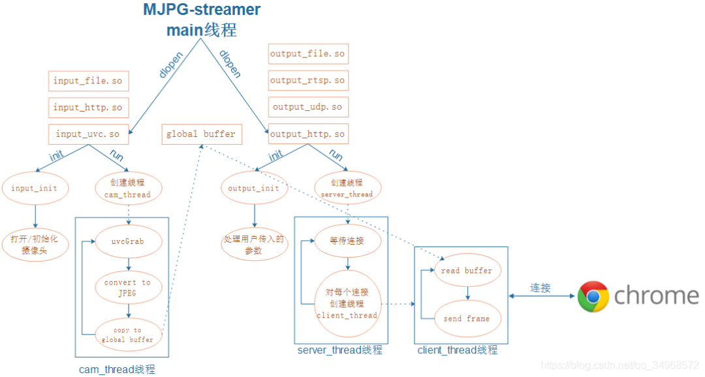

## MJPG-Streamer介绍与使用 - HQ

[TOC]

------

#### 注意

- 

------

## MJPG-Streamer 

### MJPG-Streamer 是什么？

简单地说，==Mjpg-Streamer 是一个 JPEG 文件的传输流。==

它最常用的**用途就是采集摄像头的数据，然后启动 http server，用户就可以通过浏览器查看图像数据了。**

类似 Linux 下的管道：

```
$ cat /dev/videoX | encode to JPG | http_server 
```

**官网**：

> https://sourceforge.net/projects/mjpg-streamer/

**Github**：

> https://github.com/jacksonliam/mjpg-streamer

**什么是 MJPG？**

Motion JPEG，简称 MJPG。

JPEG是静态图片的编码格式。

==MJPG 是动态的视频编码格式==，可以简单地理解：MJPG 就是把多个 JPEG 图片连续显示出来。

**MJPG 的优点？**

很多摄像头本身就支持 JPEG、MJPG，所以处理器不需要做太多处理。

一般的低性能处理器就可以传输 MJPG 视频流。

**MJPG 的缺点？**

MJPG 只是多个 JPEG 图片的组合，==它不考虑前后两帧数据的变化，总是传输一帧完整的图像，传输带宽要求高。==

==H264 等视频格式，会考虑前后两帧数据的变化，只传输变化的数据，传输带宽要求低。==

**个人感受：**

这个项目虽然已经多年不更新了，但是却一直有人使用，说明其代码品质较好。

符合 UNIX 的设计哲学：简单实用。

同时，项目的整体设计清晰，扩展性好，可读性高，**非常适合用来训练 Linux 系统下的网络和多线程编程。**


### MJPG-Streamer 怎么用？

MJPG-Streamer的依赖很少。

**编译很简单**：

```
$ sudo apt-get install cmake libjpeg8-dev
$ make
```

**最常见的用法**：

```
$ export LD_LIBRARY_PATH=`pwd`
$ ./mjpg_streamer -i "input_uvc.so -d /dev/video2 -r 640x480 -f 30" -o "output_http.so -w www"
 i: Using V4L2 device.: /dev/video0
 i: Desired Resolution: 1920 x 1080
 i: Frames Per Second.: 30
 i: Format............: JPEG
 o: www-folder-path......: ./www/
 o: HTTP TCP port........: 8080
```

==MJPG-Streamer 将图像的来源视为输入，将图像的展示视为输出。==

**每一种输入或输出是都抽象为一个插件。**

上面的例子中：

- -i 指定输入的插件为 input_uvc.so，此插件会从摄像头中采集图像。

- 子参数 -d 指定设备节点、-r 指定分辨率、-f 指定 fps。


- -o 指定输出的插件为 output_http.so，此插件会启动一个 http server。

MJPG-Streamer 启动后，在浏览器中输入：

```
127.0.0.1:8080
```

就可以看到图像了。


###  MJPG-Streamer 怎么实现的？

想要理解 MJPG-Streamer 的核心设计，要抓住 2个要点：

**1、工作模型**。

> 

MJPG-Streamer 工作时，除了 main 线程，还会起 2 个线程。

输入插件的线程 A 负责从摄像头采集一帧数据，暂存在 buffer 中。

输出插件的线程 B 负责实现 http server，当有 http client 要求访问时图像时，从 buffer 中读一帧数据，然后发送给 http client。

**2、如何实现插件化**。

MJPG-Streamer 将每一种输入或输出是都抽象为一个插件。

每一个插件，都必须实现 3 个 API:

```c
int (*init)(output_parameter *param, int id);

int (*run)(int);

int (*stop)(int);
```

- init() 负责初始化插件;


- stop() 负责让插件停止工作;


- run() 负责让插件开始工作;


==每一个插件，最终都会被编译成一个动态库。==

- main 线程中通过 dlopen、dlsym() 对插件进行统一地调度使用。


**核心数据结构：**

1、对输入插件的抽象

```c
struct _input {
    char *plugin;
    
    [...]

    // 互斥访问
    pthread_mutex_t db;
    pthread_cond_t db_update;

    // 存储图像数据
    unsigned char *buf;
    int size;

    // 统一的 API
    int (*init)(input_parameter *, int id);
    int (*stop)(int);
    int (*run)(int);
};
```

2、对输出插件的抽象

```c
struct _output {
    [...]

    // 统一的 API
    int (*init)(output_parameter *param, int id);
    int (*stop)(int);
    int (*run)(int);
};
```

==这两个数据结构基本就确定了 MPJG-Streamer的核心框架。==

如果你想了解 input_uvc.so 这个插件是如何采集摄像头数据的，那么只需要阅读其如何实现 init()、stop()、run() 这几个 API 即可。

如果你想给 MJPG-Streamer 增加功能，例如你想让其支持使用 live555 进行流媒体传输，那么你需要先学会使用 live555，然后将其用法封装成 init()、stop()、run() 供 MJPG-Streamer 调用即可。

### 总结

MJPG-Streamer 虽然老旧，但是其设计理念遵循了 UNIX 的设计哲学，Keep it simple。


