## Source Insight 软件使用 - HQ

[TOC]

------

#### 注意

- 

------

## 快捷键

| 快捷键          | 说明           |
| --------------- | -------------- |
| Alt + ,         | 后退           |
| Alt + .         | 前进           |
| F8              | 高亮选中的字符 |
| Ctrl+F          | 查找           |
| F3或Shift+F3    | 往前查找       |
| F4或Shift+F4    | 往后查找       |
| ==Ctrl+函数名== | ==可直接跳转== |
| ==Ctrl+/==      | ==查找引用==   |
|                 |                |
|                 |                |
|                 |                |
|                 |                |
|                 |                |
|                 |                |
|                 |                |
|                 |                |
|                 |                |
|                 |                |
|                 |                |
|                 |                |
|                 |                |
|                 |                |
|                 |                |
|                 |                |
|                 |                |

###  常用快捷键

1. ==Ctrl + 鼠标单击 进入定义.==
2. Alt + F12可以切换，让字符宽度变得一致，或者是大小不同地显示。
3. Shift + F8 标亮文本中光标所在的单词。
4. Ctrl + G (或者F5) 跳转到某一行。
5. Ctrl + O 搜索文件，找到回车打开，找不到ESC退出
6. Alt + G (或者F7) 打开Symbol Window.
7. Alt +, 后退；Alt+.前进.
8. Ctrl + F 查找关键字。
9. Ctrl + / 查找整个工程哪里出现整个字符串

## 建立工程

>1. 在源文件夹同级目录新建**si**文件夹
>
>2. 保存si文件夹的路径
>
>3. 打开软件，新建Project
>
>4. 将“项目数据文件存储路径”改为si文件夹路径
>
>5. 将源文件全部添加进来
>
>6. 点击Project   --->点击同步文件
>
>  > 
>  >
>  > 

## 使用方法整理

#### 修改编码方式

临时更改

> 
>
> 

永久更改

> 
>
> 

#### 修改字体格式大小

> 
>
> 

#### 括号配对高亮

“在前括号左侧，后括号左侧”双击鼠标左键，可以选定匹配括号和其中内容（《》，（），L{R}，［］之间）。

#### 让{ 和 } 不缩进

Options -》 Document Options -》 Auto Indenting -》 Auto Indent Type 选 Simple。
还有：让{ 和 } 不缩进： options-》document options-》auto indent 去掉indent Open Brace和Indent Close Brace。 （不好使，括号无法配对对齐！）

#### 添加文件类型

用户可以定义自己的类型，Options-》Document Options-》add type，定义文件类型名以及文件名后缀。
勾选include when adding to projects在添加目录下文件到工程是该类文件就会添加进SI的工程。
如果需要将所有文件添加进SI的工程，可以定义一种文件类型*.*。

#### 恢复ctrl+a的全选功能

Options -》 Key Assignments：通过关键词save 找到save all，更改为ctrl+shift+a，通过关键词select找到select all，更改为ctrl +a。

#### 设置背景色

Options-》preference-》color-》windows background设置背景色（护眼色：85，90，205）。

#### 字符大小不一

方法1：选上“view --》 draft view”， 就可以让每个字符的宽度一致了。快捷键是 “Alt + F12”。
方法2：解决中文注释字体间距太大。
（1）.Options-》Style Properties
（2）。 在左边Style Name下找到Comment Multi Line和Comment.在其右边对应的Font属性框下的Font Name中选“Pick.。。” 设置为宋体、常规、小四。确定，退回Style Properties界面，Size设为10。最后设置Clolors框下Foreground，点“Pick.。。”选择一种自己喜欢的颜色就OK了
注：以上方法1为通用设置，方法2中可以设置注释字体以及字体大小！

#### 删除注释时半个汉字问题（删除一个汉字，汉字没有了，但会多出一个问号？）

方法：
① 将 SuperBackspace.em 复制到 Source Insight安装目录；
② Project→Open Project，打开Base项目；
③ 将复制过去的SuperBackspace.em添加入Base项目；
④ 重启SourceInsight；
⑤ Options→Key Assignments，将Marco： SuperBackspace绑定到BackSpace键；

#### 实用快捷键

Shift+F8：高亮选中的字
“ctrl + g” 或 “F5”：跳到指定行
“Ctrl+=” 或 Ctrl+鼠标点击标识：直接跳转至标识定义处调用处
Ctrl+F：本文件内查找
F7：打开Browse Project Symbols窗口，快速浏览工程内标识定义
F3　：本文件查找结果的上一个
F4　：本文件查找结果的下一个
Ctrl+M　：创建或查找书签，方便下次找回此位置

#### 解决TAB键缩进问题

Options-》 Document Options里面的右下角Editing Options栏里，把Expand tabs勾起来，然后确定。OK，现在TAB键的缩进和四个空格的缩进在SIS里面看起来就对齐。
Linux下TAB是8个空格长度，这样设置可以让TAB和4个空格保持一致！）
source insight4.0软件功能

#### 解析日志信息时非常有用的Source Link

总地说来，SourceLink根据特定的搜索模式，把当前文件中满足模式的行、链接到由该行指定的其他源文件中。
所谓特定的搜索模式，共有两种"File, then line"和"Line, then file"，其中前后两部分依靠正则表达式的组的概念来予以分割。如果当前文件具有匹配行，比如"Error d:tcsrcq5.c 18: Lvalue required in function jsSort"，那么SourceInsight在该行创建SourceLink、把该行链接到由该行指定的文件中（即d:tcsrcq5.c，第18行）。

1. 创建SourceLink
   运行Search菜单的Parse Source Links…命令，在弹出的框中、选择搜索模式、并填入相应的正则表达式串，点OK，SIS就会解析当前文件，如果有匹配，就创建SourceLink。
2.  在解析日志信息时，使用SourceLink
   可以打开日志信息，运行Parse Source Links命令，日志中能够匹配模式的每一行（通常是含有错误信息的行）、就会被设置上一个SourceLink
3. 在解析自定义命令输出时，使用SourceLink
   首先勾选Custom Command 中的"Parse Links in Output"，然后选择特定的搜索模式，最后填入合适的正则表达式。这样，Source Insight把输出信息作为当前搜索用文件；并且，如果有匹配行（通常即编译错误信息行），SIS为 该行创建SourceLink、并把每一个错误信息中给定的文件（和行号）作为link目的地，这对于我们修改源代码错误非常有帮助。 

#### 替换（Replace） VS 上下文敏感的智能重命名（Context-Sensitive Smart Rename）

1. 替换（Replace）
   目前来说，普通的替换命令、快捷键为ctrl+H，足以已满足工作要求。
   在弹出的替换窗口中，在Search框中勾选Selection来只在所选文本区域中替换（当然这时你要先选定区域然后再按ctrl+H）、勾选WholeFile来在整个当前文件内替换、两者都不勾选来从当前光标处替换至文件末尾；点右边的Files…按钮，可选择替换多个文件的内容。
2. 上下文敏感的智能重命名（Context-Sensitive Smart Rename）
   Smart Rename命令、快捷键是Ctrl+'，是上下文敏感的全局搜索替换。它可以智能地重命名全部项目文件中的一个标示符。SourceInsight的搜索索引（search index）使得搜索过程进行地非常快。而且，使用Smart Rename所做的替换会被记录在Search Results窗口中，每一条替换记录旁有一个SourceLink链接到替换发生地文件。
   Smart Rename可以用来重命名标记（symbol）。如果勾选了Smart Reference Matching选项，Smart Rename就只在正确的上下文范围内进行重命名。它可以智能地重命名全部项目文件中的一个标示符；它可以重命名函数本地变量，类或结构体成员、函数。

## 使用Source Insight阅读Linux内核源码

【嵌入式Linux应用开发完全手册V4.0_韦东山全系列视频文档-IMX6ULL开发板】

【第2篇 - 第八章 编程前的准备工作 - 8.4 使用Source Insight阅读Linux内核源码 P160】

1. Source Insight简介
   - 官网主页 https://www.sourceinsight.com/
   - 软件下载页面 https://www.sourceinsight.com/trial/
   - 用户使用教程 https://www.sourceinsight.com/doc/v4/userguide/index.html
2. 在Windows上解压内核源码
3. 建立工程示例
   1. 新建工程
   2. 设置工程名及工程数据目录
   3. 制定源码目录
   4. 添加源码
   5. 同步文件
4. 操作示例
   1. 打开工程
   2. 在工程中打开文件
   3. 在文件中查看函数或变量的定义
   4. 查找函数或变量的引用
   5. 其他快捷键

---

#### 1 - 建立工程示例

本节新建一个linux kernel的source Insight工程，你也可以为其他APP建立工程，方法是一样的。

##### 1. 新建工程

运行source Insight，点击菜单“Project->New Project”,如下图所示：

​                           

##### 2. 设置工程名及工程数据目录

在弹出的New Project对话框中设置“New project name”(项目的名称)，然后设置Where do you want to store the project data file? (项目文件保存位置)，点击Browse按钮选择源码的目录即可。

 

##### 3. 指定源码目录

设置“**Project Source Directory – the main location of your source files”**(源码目录)，

点击红框左边“…”选择源码目录，点击OK，如下图：

 

##### 4. 添加源码

在新弹出的对话框中，点击“Add”或“Add All”。“Add”是手动选择需要添加的文件，而“Add All”是添加所有文件。我们使用“Add All”,在弹出的提示框中选中“Recursively add lower sub-directories”(递归添加下级的子目录)并点击OK。同样的Remove File,Remove All是移除单个文件或者移除所有文件，如下图：

 

添加文件完成后点击Close，此时界面会返回到主界面，如下图，点击“Close”：

 

 

##### 5. 同步文件

同步文件的意思是让Source Insight去解析源码，生成数据库，这样有助于以后阅读源码。比如点击某个函数时就可以飞快地跳到它定义的地方。

先点击菜单“Project->Synchronize Files”，如下图所示：

 

 在弹出的对话框中 选中“Force all files to be re-parsed”(强制解析所有文件)，并点击“Start”按钮开始同步，如下图所示：

 

 

#### 2 - 操作示例

##### 1. 打开工程

前面建议工程后，就会自动打开了工程。如果下次你想打开工程，启动Souce Insight后，点击菜单“Project -> Open Porject”就可以在一个列表中选择以前建立的工程，如下图：

 

 

##### 2. 在工程中打开文件

点击"P"图标打开文件列表，双击文件打开文件，也可以输入文件名查找文件，如下图所示：

  

 

##### 3. 在文件中查看函数或变量的定义

打开文件后，按住ctrl键的同时，用鼠标点击函数、变量，就会跳到定义它的位置，如下图所示：

  

##### 4. 查找函数或变量的引用

双击函数，右键点击弹出对话框选择“Lookup Reference”；或者双击函数后，使用快捷键"ctrl+/"来查找引用，如下图：

 

 

## Source Insight功能 - 查看函数调用

source insight相信大家用的很多了，我本人以前也用得很多，只是后来转到vscode了，最近搞一个项目，层层调用实在是太多了，有时候找代码根源都忘记自己是从哪里开始的。

偶然记得source insight有一个relation window的功能，然后我在vscode上面没有找到相应的插件，所以又用了source insight，给大家演示一下。

在source insight的view菜单中点出relation window，或者在下图所示位置直接点击

点击上面的红框会开关这个relation window选项，效果如图所示：

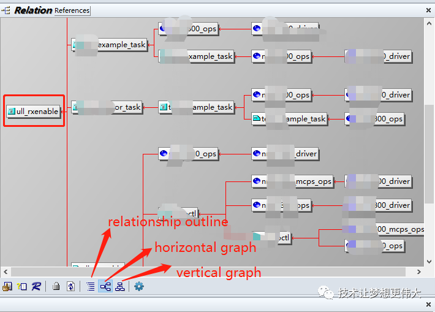

有horizontal graph 或者 vertical graph 图形界面话的，看起来很清楚，也有关系表的。

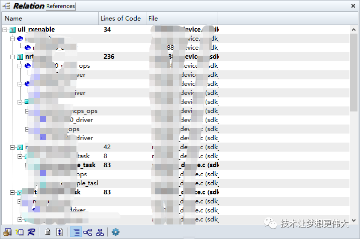

调用的分支关系也是可以设置的，上面的我设置了4级

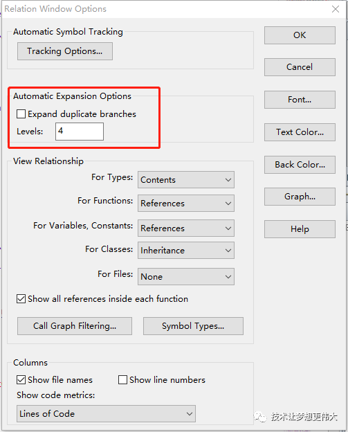

一般设置2个分支就够了，如下图，这样就清楚一些了

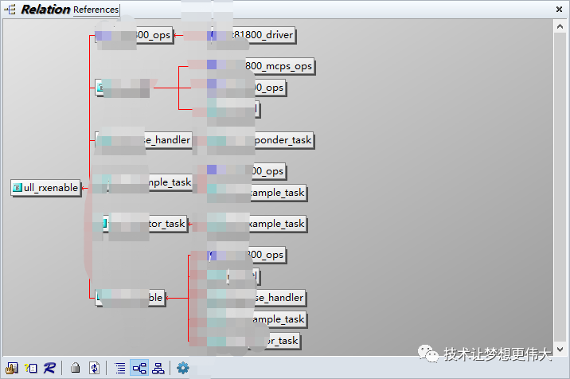

## 解决中文乱码问题

其实要想解决这个问题，我们首先思考的一个方向就是，出现了乱码，无非就是低版本的source insight 3.5版本不支持某些编码，而我们平时可能用的比较多的字符编码是UTF-8的，但是低版本的source insight 3.5它当初开发的时候，就不支持这个字符编码，所以我们在打开别人的代码工程的时候，就会出现乱码！

上面我之前给的建议修改字体，不是根本解决问题的方法，根本解决问题的方法就是我上面说的原因。

有了上面的思路，下面我举个例子，比如我现在打开的工程里面，我故意加了一段乱码注释：

这个时候，解决的方法是：用Nodep++打开：

这里可能你打开时候正常是乱码的，我这里是特地设置的utf-8的编码格式，为了做演示，默认source insight 3.5 支持ANSI编码格式，所以我们利用Nodep++修改这个源码文件的字符编码格式就行：

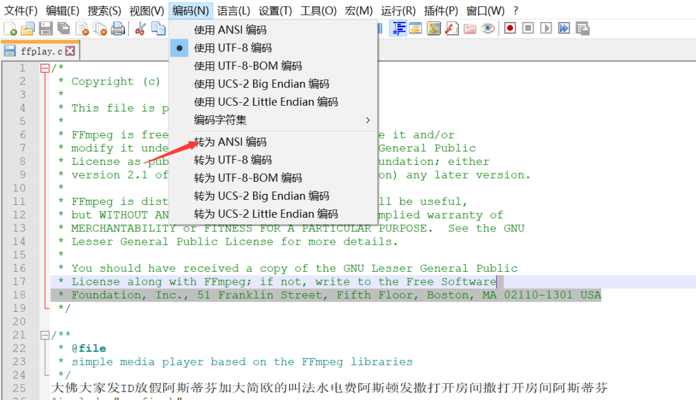

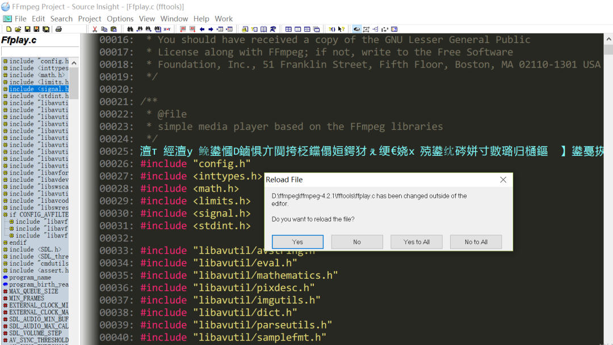

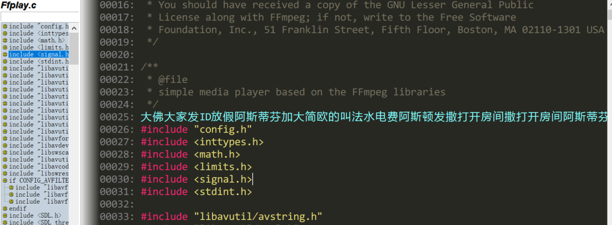

## 自动补全功能问题

source insight里，目测要开启自动补全]功能的设置有两个相关地方：

1.Options -> Preferences ->Typoptions ->Typing -> Auto completion 一栏里的 Use automatic symbol completion window

2.Options -> Document Options ->Editing Options 一栏里的 Allow auto-complete（好不容易找到的）

## tab补齐提示,大括号对齐

### 大括号自动缩进问题

主要就是设C Source File和C++ Source File，选好后点右边中间的Auto Indent调整缩进。单选里一定要点Smart，右边有两个复选框Indent Open Brace和Indent Close Brace，把两个复选框都取消掉。然后点OK.
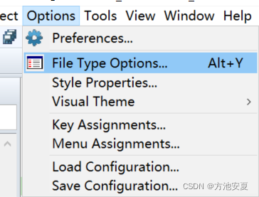
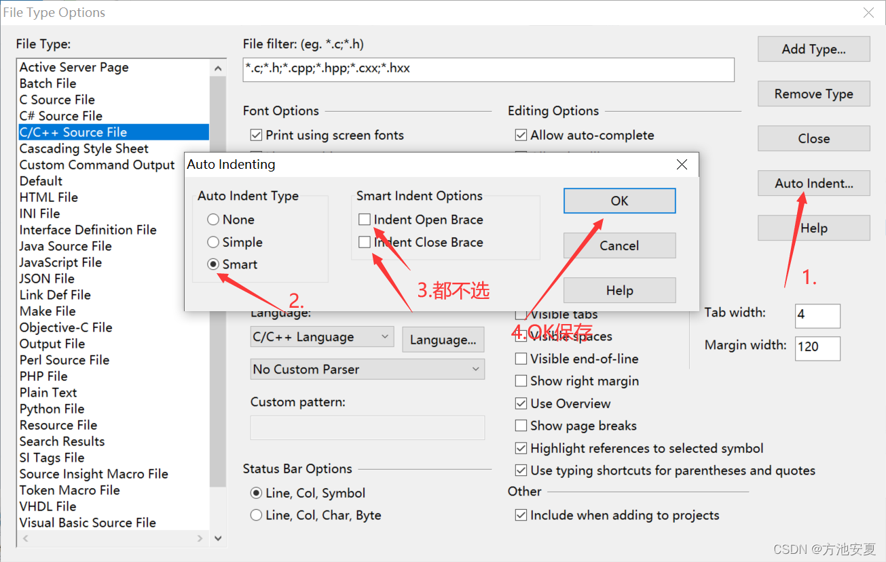
完成

### tab补齐提示

vs用户习惯tab补齐提示内容,这里原本是回车.

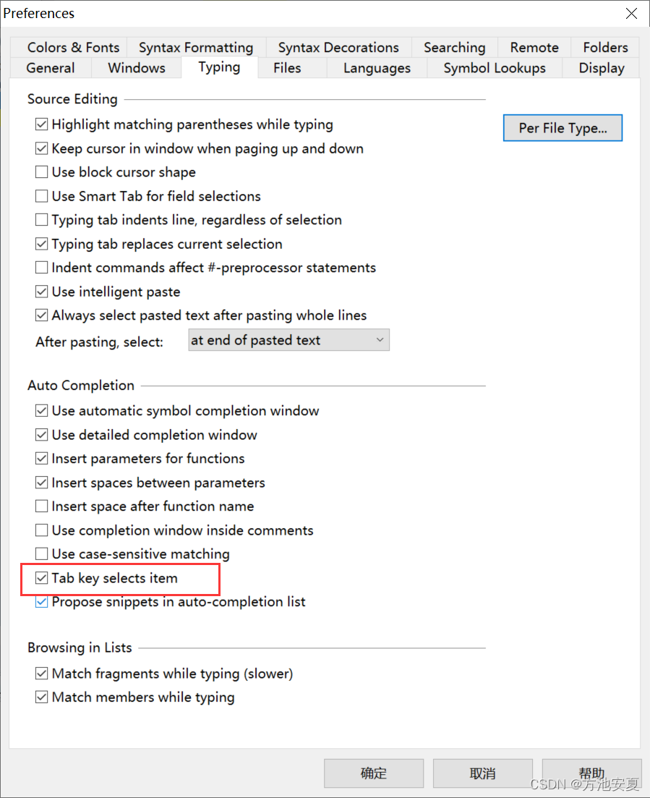

### 其他

## 自动补全模板修改方法

1.修改自动补全关键字模板
使用sinppets window修改自动补全关键字模板如for、if、while等。右键图2中想要修改的关键字，选择edit snippet即可打开并修改模板，如打开for循环关键字模板，将模板修改为自己喜欢的模式。本人就比较喜欢图3这种对齐方式，大括号放在for的正下方不缩进，而括号内的内容缩进2个空格。

图 1 sinppets window按钮
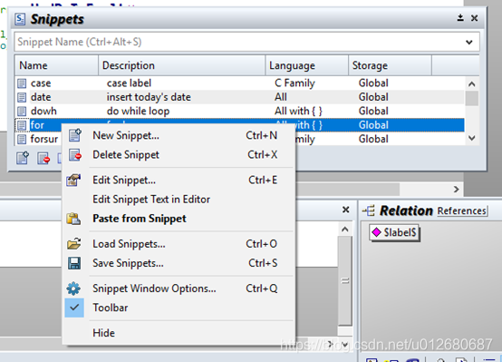
图 2 snippets window
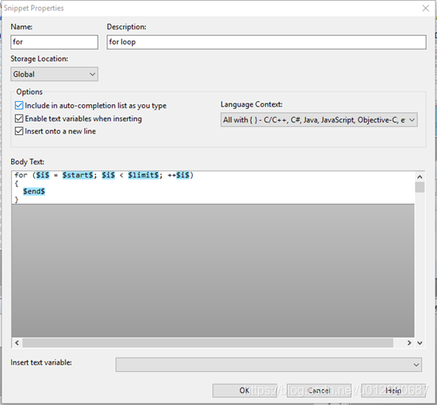
图 3 for循环模板修改

