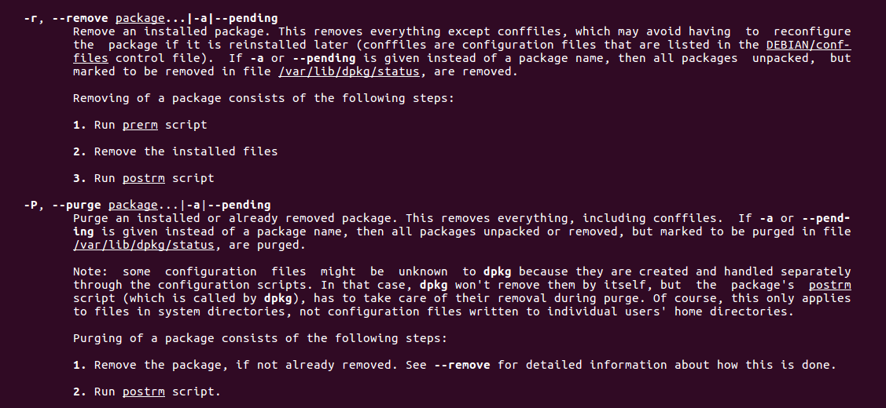
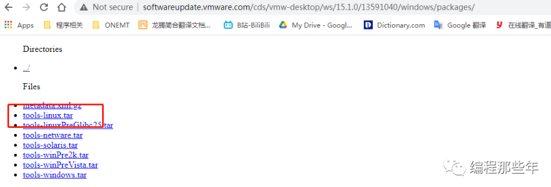
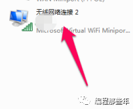
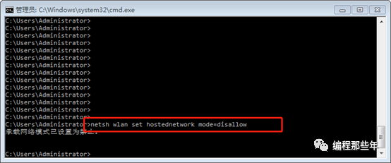
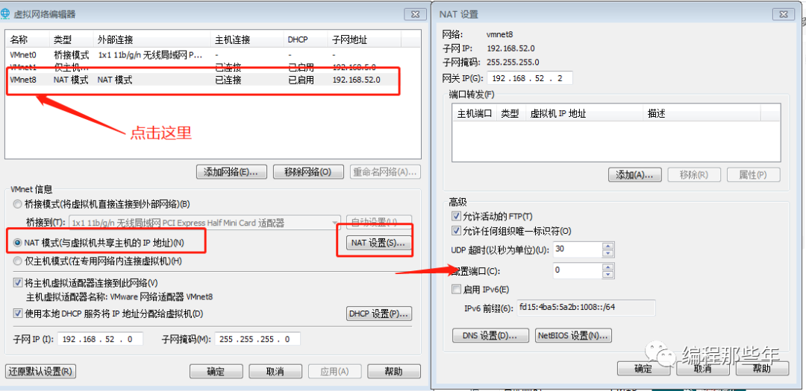
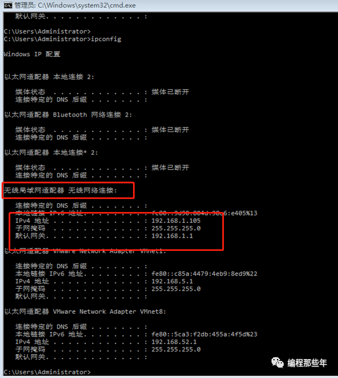
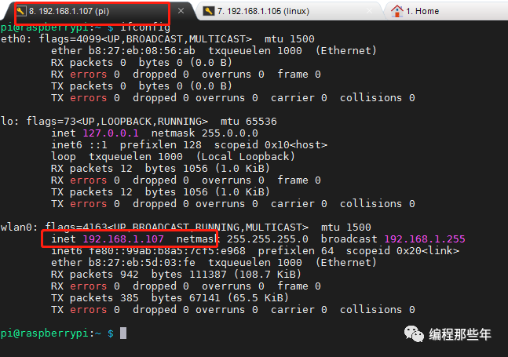

## 虚拟机安装ubuntu及基本设置 - HQ

[TOC]

------

#### 注意

- 

------

## 遇到的问题及解决方法

#### 无法从win中复制内容到虚拟机中 / 无法直接拖拽文件到虚拟机中

打开虚拟机之前，客户机隔离选项正常，打开虚拟机之后变灰色，不可用。重新虚拟机没有用，重新安装vmware tools依然是这样。

通过下面指令重新安装问题解决

> 安装过程中提示是否替换版本，一律选择Y

```
sudo apt-get update
sudo apt-get install open-vm-tools-desktop
```

重启生效

```
reboot
```

#### ubuntu20.04安装时界面显示不完整

> 按住win后用鼠标可以拖动界面

#### USB插入后，虚拟机正常提示，但ubuntu内不显示

> 重装一个ubuntu系统（此ios系统有问题）

#### USB插入后，提示无法连接

> 虚拟机设置成USB3.0

#### 其他：解决USB不能自动识别问题（来自网络，未生效)

```cpp
最近项目需要在Android源码中进行开发，于是在Virtual Box中安装Ubuntu，郁闷的是插上usb连接线，连接上手机，Ubuntu不能自动识别连接设备。在网上搜索了很多解决办法，各抒己见，最终找到一种可行的解决方案：

1、安装usbmount

$ sudo apt-get install usbmount
2、更改usbmount配置文件

$ sudo gedit /etc/usbmount/usbmount.conf
3、在打开的文件中找到FILESYSTEM，并在其中添加vfat,ntfs

4、FS_MOUNTOPTIONS这个选项里加入”"-fstype= vfat,iocharset=utf8,codepage=936,umask=000,users”

5、重启udev

$sudo /etc/init.d/udev restart
6、重启Ubuntu

$ sudo reboot
重启之后即可识别USB。
```

#### 网络连接的标志不显示，连接不上网

>

```cpp
sudo service network-manager stop
sudo rm /var/lib/NetworkManager/NetworkManager.state
sudo service network-manager start

sudo gedit /etc/NetworkManager/NetworkManager.conf
把false改成true

sudo service network-manager restart
```


## 分区设置

方案引用

Swap（相当于电脑内存）：逻辑分区、大小设置为电脑内存大小，4G = 4096M；

/boot（[引导分区](https://www.baidu.com/s?wd=引导分区&tn=24004469_oem_dg&rsv_dl=gh_pl_sl_csd)）：[主分区](https://www.baidu.com/s?wd=主分区&tn=24004469_oem_dg&rsv_dl=gh_pl_sl_csd)：大小设置为2G = 2048M；

/home（用户存储数据用）：逻辑分区，要尽可能大，40G。

/.（主分区）：主分区，用于存放系统，相当于windows的C盘，30G。


 

 

  

  

 

 

  安装完成后系统情况 `df -h`

> 


## 安装基本软件

```shell
sudo apt-get update
sudo apt-get upgrade
sudo apt-get install vim
sudo apt-get install net-tools
# 该命令将安装一堆新包，包括gcc,g++和make
sudo apt-get install build-essential
```

安装vmware-tools

> 全程输入yes，以防有的功能没有给安装上

> 

设置共享文件夹

> 

在虚拟机中更改共享文件夹位置（默认位置/mnt/hgfs）

> 


## 配置Vim

> 
>
> 


## 配置ssh/ftp

**安装ssh服务**

`sudo apt-get install openssh-server`

**启动ssh**

`sudo /etc/init.d/ssh start`

**FileZilla设置**

> 

```
FileZilla 实现Ubuntu 虚拟机与Win7 主机的文件共享
1. 打开FileZilla 客户端，点击【文件】->【站点管理器】->【添加新站点】
2. 设置【通用】选项卡：
（1）主机：虚拟机IP 地址
这⾥我们看到当前系统的IP 地址是:192.168.1.101
（2）协议SFTP/端口22（端⼝不提供保存，在连接时输入即可）
（3）登录类型：一般
（4）用户名/密码：虚拟机中登录Ubantu 的账户和密码
3.【高级选项卡】中设置Win7 中某文件夹为【默认本地目录】
4. 每次输入端口号进⾏链接，结果出现如下信息，需检查虚拟机中的SSH 服务是否安装
错误：Network error:Connection refused
错误：无法连接到服务器
5. 安装ssh server:sudo apt-get install openssh-server
6. 查看进程：ps -e | grep sshd,出现如下结果，则ssh 服务启动
或
查看ssh 服务状态：sudo /etc/init.d/ssh status,有如下结果，则服务启动
如没有启动，用sudo /etc/init.d/ssh start 启动
7. 重新用FileZilla 连接Ubuntu 虚拟机，出现如下信息点击连接，则连接成功：
8. 在home/目录下创建新目录作为远程站点的目标目录：sudo mkdir softdir
9. 用FileZilla 向softdir 目录传送⽂件，如果有下列错误：
错误: /home/softdir/apr-util-1.4.1.tar.gz: open for write:permission denied
错误: 文件传输失败
则需更改⽬录权限：sudo chmod 777 softdir/
10 .可通过拖拽把本地文件传到远程站点
```


## 其他设置

#### 配置ubunut软件源 

首先在 `/etc/apt/sources.list`  中更改成下面的软件源

```shell
# 中科院软件源
deb http://mirrors.ustc.edu.cn/ubuntu/ bionic-security main restricted
deb http://mirrors.ustc.edu.cn/ubuntu/ bionic-security universe
deb http://mirrors.ustc.edu.cn/ubuntu/ bionic-security multiverse
```

使用 `apt-get update` 更新一下源

> 这个命令的作用是访问/etc/apt/source.list文件中的每一个服务器，读取可以支持下载的软件列表，并保存到本地计算机中（/var/lib/apt/lists）。
>
> 软件列表的另一个作用是可以帮助你更新软件。服务器上的软件版本会不断更新，你本地已经安装的软件如果和软件列表中的版本不一致，则系统就会提示你软件需要更新。

#### 设置终端格式

> 

#### 虚拟机配置

> 


## ubuntu下boot分区空间不足问题的解决方案

https://blog.csdn.net/along_oneday/article/details/75148240

用了一段时间的ubuntu 16.04的系统后，中间出现过几次提示boot分区空间不足的问题，大体的提示如下：The volume "boot" has only 5.2 MB disk space remaining.

> 

当时在网上搜了很多解决办法，最后问题也解决了，不过由于boot分区空间的问题以后还会出现，所以做一个博客整理一下遇到的问题以及解决方法。

打开终端，

$ df -h /boot

查看boot分区信息，显示如下：

> 

一开始装双系统的时候，自己给boot分区只分了135M的空间，现在看来还是太小了。

输入命令，查看目前系统中安装的内核镜像

$ dpkg --get-selections |grep linux-image

出现如下信息：

> 

在Ubuntu的内核镜像中包含了以下的包：

linux-image- （内核镜像）

linux-image-extra- （额外的内核模块）

键入命令，查看本机系统的内核版本：

$ uname -r

输出显示是： 4.8.0-58-generic

所以对于我的电脑系统来说，需要删除的是linux-image-4.8.0-56-generic与linux-image-extra-4.8.0-56-generic，只留下4.8.0-58版本的两个包以及linux-image-generic-hwe-16.04文件，所以输入以下命令：

$ sudo apt-get remove linux-image-4.8.0-56-generic linux-image-extra-4.8.0-56-generic

经过一段时间，卸载完成，输入相关命令查看此时系统中所含有的内核镜像

$ dpkg --get-selections |grep linux-image

出现如下信息：

> 

发现刚刚删除的两个镜像文件已经是deinstall状态了，此时查看boot分区空间信息

$ df -h /boot

显示信息：

> 

可用空间变为了56M，说明卸载成功了。

至于为什么还会出现deinstall信息，原因就是因为remove命令只会删除相应的文件，并不会删除相应的配置信息，要删除相应的配置信息，需要采用purge命令

$ sudo dpkg -P linux-image-4.8.0-56-generic linux-image-extra-4.8.0-56-generic

再次查看内核信息

> 

带有deinstall信息的包都已经被删除了，至此，操作完成。

注：在此记录一下apt-get命令与dpkg命令下包的删除操作，两条命令下都含有remove以及purge参数，具体的不同，查看了一下apt-get与dpkg的命令手册。

首先是apt-get命令：

> 

remove命令会保留相应的配置文件，所以上面apt-get remove命令后还会有deinstall文件就不难理解了。然后是dpkg命令：

> 

命令描述比较长，简单来说，dpkg命令下的-r 或者 -remove命令会删除除了配置文件之外的所有文件，而-P或者 --purge命令会将包括配置文件在内的内容一起删除，所以删除的时候看自己的爱好选择了。

另外，自己试了一下，把旧的内核头文件删除，步骤如下：

查看内核头文件：

$ dpkg --get-selections |grep linux-headers

显示如下：

> 

采用dpkg命令下的-P命令

$ sudo dpkg -P linux-headers-4.8.0-56 linux-headers-4.8.0-56-generic

再次显示头文件信息：

> 

操作完成，此时没有出现deinstall文件。

注：有关linux-image-extra package的内容可参考网址：

https://askubuntu.com/questions/153023/what-is-the-linux-image-extra-package-for-and-do-i-need-it

有关hwe（hardware enablement）有关的内容可参考网址：

https://askubuntu.com/questions/248914/what-is-hardware-enablement-hwe


# VMware配置文章 - 摘录

[公众号：编程那些年](http://mp.weixin.qq.com/mp/homepage?__biz=MzkzMDE4MDM2NQ==&hid=1&sn=fe7a2b6dde522625011e175f14ffece7&scene=18#wechat_redirect)

## VMware Tools 安装教程

### 前言

通常VMware再安装完虚拟机后，会自动安装VMware Tools， 但有时候会因为各种原因导致Tool工具没有正常安装，下面就来讲下如何重新安装VMWare Tools及各类常见问题排查。

### 配置环境

  VMware  15.1.0

  Ubuntu 18.04

### 安装流程

首选，保证**虚拟机处于开机状态**，然后选择**“虚拟机->重新安装VMware Tools(T)...”** 或者 **“虚拟机->安装VMware Tools(T)...”**

(PS:如果此处**“重新安装VMware Tools(T)..”**处于灰化状态，可以先跳到后面的**"常见问题排查"**中的问题一：**“安装VMware Tools(T)...”**处于灰化状态对问题进行排查）

>

  此时会在虚拟的桌面生成**“VMware Tools”**的DVD光驱挂载点，如下所示：

>

通过**“mount | grep VM”**，我们可以看到实际挂载在**“/media/linux/VMware Tools”**目录，如下：

```
linux@ubuntu:~$ mount | grep VM
/dev/sr0 on /media/linux/VMware Tools type iso9660 (ro,nosuid,nodev,relatime,nojoliet,check=s,map=n,blocksize=2048,uid=1000,gid=1000,dmode=500,fmode=400,uhelper=udisks2)
linux@ubuntu:~$
```

因此，我们可以进入到**“/media/linux/VMware Tools”**目录，将VMwareTools压缩包拷贝到家目录下，如下所示：

```
linux@ubuntu:~$ cd /media/linux/VMware\ Tools
linux@ubuntu:/media/linux/VMware Tools$ ls
manifest.txt
run_upgrader.sh
VMwareTools-10.3.10-12406962.tar.gz
vmware-tools-upgrader-32
vmware-tools-upgrader-64
linux@ubuntu:/media/linux/VMware Tools$ cp VMwareTools-10.3.10-12406962.tar.gz  /home/linux/
linux@ubuntu:/media/linux/VMware Tools$ cd
linux@ubuntu:~$ ls VMwareTools-10.3.10-12406962.tar.gz
VMwareTools-10.3.10-12406962.tar.gz
linux@ubuntu:~$
```

然后解压该压缩包，得到vmware-tools-distrib目录，如下：

```
linux@ubuntu:~$ tar -xf VMwareTools-10.3.10-12406962.tar.gz
linux@ubuntu:~$ ls
Desktop           Public
Documents         Templates
Downloads         Videos
examples.desktop  VMwareTools-10.3.10-12406962.tar.gz
Music             vmware-tools-distrib
Pictures
linux@ubuntu:~$
```

进入“**vmware-tools-distrib”**目录，运行**“sudo ./vmware-install.pl ”** 命令，然后一路的yes和回车即可，如下所示：

```
linux@ubuntu:~/vmware-tools-distrib$ cd ..
linux@ubuntu:~$ cd vmware-tools-distrib/
linux@ubuntu:~/vmware-tools-distrib$ ls
bin  doc  FILES    installer  vgauth
caf  etc  INSTALL  lib        vmware-install.pl
linux@ubuntu:~/vmware-tools-distrib$ sudo ./vmware-install.pl 
[sudo] password for linux: 
open-vm-tools packages are available from the OS vendor and VMware recommends 
using open-vm-tools packages. See http://kb.vmware.com/kb/2073803 for more 
information.
Do you still want to proceed with this installation? [yes] yes

INPUT: [yes]

A previous installation of VMware Tools has been detected.

The previous installation was made by the tar installer (version 4).

Keeping the tar4 installer database format.

You have a version of VMware Tools installed.  Continuing this install will 
first uninstall the currently installed version.  Do you wish to continue? 
(yes/no) [yes] yes

INPUT: [yes]

Uninstalling the tar installation of VMware Tools.

Stopping services for VMware Tools

Stopping VMware Tools services in the virtual machine:
   Guest operating system daemon:                          done
   VGAuthService:                                          done
   VMware User Agent (vmware-user):                        done
   Blocking file system:                                   done
   Unmounting HGFS shares:                                 done
   Guest filesystem driver:                                done

cat: /tmp/_cafenv-appconfig_: No such file or directory
This program previously created the directory /etc/vmware-caf/pme/config, and 
was about to remove it. Since there are files in that directory that this 
program did not create, it will not be removed.

This program previously created the directory /etc/vmware-caf/pme, and was 
about to remove it. Since there are files in that directory that this program 
did not create, it will not be removed.

This program previously created the directory /etc/vmware-tools, and was about 
to remove it. Since there are files in that directory that this program did not
create, it will not be removed.

This program previously created the directory /etc/vmware-caf, and was about to
remove it. Since there are files in that directory that this program did not 
create, it will not be removed.

File /etc/pulse/default.pa is backed up to /etc/pulse/default.pa.old.0.

The removal of VMware Tools 10.3.10 build-12406962 for Linux completed 
successfully.

Installing VMware Tools.

In which directory do you want to install the binary files? 
[/usr/bin] 

INPUT: [/usr/bin]  default

What is the directory that contains the init directories (rc0.d/ to rc6.d/)? 
[/etc] 

INPUT: [/etc]  default

What is the directory that contains the init scripts? 
[/etc/init.d] 

INPUT: [/etc/init.d]  default

In which directory do you want to install the daemon files? 
[/usr/sbin] 

INPUT: [/usr/sbin]  default

In which directory do you want to install the library files? 
[/usr/lib/vmware-tools] 

INPUT: [/usr/lib/vmware-tools]  default

The path "/usr/lib/vmware-tools" does not exist currently. This program is 
going to create it, including needed parent directories. Is this what you want?
[yes] 

INPUT: [yes]  default

In which directory do you want to install the common agent library files? 
[/usr/lib] 

INPUT: [/usr/lib]  default

In which directory do you want to install the common agent transient files? 
[/var/lib] 

INPUT: [/var/lib]  default

In which directory do you want to install the documentation files? 
[/usr/share/doc/vmware-tools] 

INPUT: [/usr/share/doc/vmware-tools]  default

The path "/usr/share/doc/vmware-tools" does not exist currently. This program 
is going to create it, including needed parent directories. Is this what you 
want? [yes] 

INPUT: [yes]  default

The installation of VMware Tools 10.3.10 build-12406962 for Linux completed 
successfully. You can decide to remove this software from your system at any 
time by invoking the following command: "/usr/bin/vmware-uninstall-tools.pl".

Before running VMware Tools for the first time, you need to configure it by 
invoking the following command: "/usr/bin/vmware-config-tools.pl". Do you want 
this program to invoke the command for you now? [yes] 

INPUT: [yes]  default

Initializing...


Making sure services for VMware Tools are stopped.

Stopping VMware Tools services in the virtual machine:
   Guest operating system daemon:                          done
   VGAuthService:                                          done
   VMware User Agent (vmware-user):                        done
   Blocking file system:                                   done
   Unmounting HGFS shares:                                 done
   Guest filesystem driver:                                done


The module vmci has already been installed on this system by another installer 
or package and will not be modified by this installer.

The module vsock has already been installed on this system by another installer
or package and will not be modified by this installer.

The module vmxnet3 has already been installed on this system by another 
installer or package and will not be modified by this installer.

The module pvscsi has already been installed on this system by another 
installer or package and will not be modified by this installer.

The module vmmemctl has already been installed on this system by another 
installer or package and will not be modified by this installer.

The VMware Host-Guest Filesystem allows for shared folders between the host OS 
and the guest OS in a Fusion or Workstation virtual environment.  Do you wish 
to enable this feature? [yes] yes

INPUT: [yes]

The vmxnet driver is no longer supported on kernels 3.3 and greater. Please 
upgrade to a newer virtual NIC. (e.g., vmxnet3 or e1000e)

The vmblock enables dragging or copying files between host and guest in a 
Fusion or Workstation virtual environment.  Do you wish to enable this feature?
[yes] yes

INPUT: [yes]


Skipping configuring automatic kernel modules as no drivers were installed by 
this installer.


Disabling timer-based audio scheduling in pulseaudio.

Do you want to enable Guest Authentication (vgauth)? Enabling vgauth is needed 
if you want to enable Common Agent (caf). [yes] yes

INPUT: [yes]

Do you want to enable Common Agent (caf)? [no] yes

INPUT: [yes]


Detected X server version 1.20.5


Distribution provided drivers for Xorg X server are used.

Skipping X configuration because X drivers are not included.


Skipping rebuilding initrd boot image for kernel as no drivers to be included 
in boot image were installed by this installer.


NOTE: both /etc/vmware-tools/GuestProxyData/server/key.pem and 
      /etc/vmware-tools/GuestProxyData/server/cert.pem already exist.
      They are not generated again. To regenerate them by force,
      use the "vmware-guestproxycerttool -g -f" command.

The configuration of VMware Tools 10.3.10 build-12406962 for Linux for this 
running kernel completed successfully.

You must restart your X session before any mouse or graphics changes take 
effect.

To enable advanced X features (e.g., guest resolution fit, drag and drop, and 
file and text copy/paste), you will need to do one (or more) of the following:
1. Manually start /usr/bin/vmware-user
2. Log out and log back into your desktop session
3. Restart your X session.

Found VMware Tools CDROM mounted at /media/linux/VMware Tools. Ejecting device 
/dev/sr0 ...
Enjoy,

--the VMware team

linux@ubuntu:~/vmware-tools-distrib$
```

这样正常就把VMware Tools安装好了，至于在安装之前和安装之后出现的几种常见问题，可根据如下常见问题排查进行排查.

###  常见问题排查

**问题一：“安装VMware Tools(T)...”处于灰化状态**

  启动虚机后，无法选择“***\**\*安装VMware Tools(T)...\*\**\***”选项的，如下图：

>

  这可能是由于安装了精简版的workstations所致，可通过官网下载对应的tools工具包，官网地址如下：

```
http://softwareupdate.vmware.com/cds/vmw-desktop/ws/
```

以VMware workstations 15.1.0为例， 下载如下所示的工具包：

>

然后提取其中的ISO文件（如VMware workstatons 15.1.0对应的VMware-tools-linux-10.3.10-12406962.iso），然后通过菜单栏上的 **“设置->虚拟机设置->CD/DVD->使用ISO镜像文件”**（虚拟机保持启动状态），选择提取出来的ISO文件，并勾选"已连接"，如下：

>

此时会在虚拟的桌面生成**“VMware Tools”**的DVD光驱挂载点，如果虚拟机桌面还无法识别到DVD光驱挂载点，可以尝试重启VMware和虚拟机试下。

**问题二、虚拟机窗口显示太小**

选择菜单中的**“查看->自动调整大小->自动适应客户机**”，即可自适应虚拟机窗口大小，将其平铺至VMware主窗口中，如下：

  >

**问题三、如何挂载Windows主机的共享目录**

通过菜单栏上的**“设置->虚拟机设置->选项->共享文件夹”**，选择**“总是启用”**，并通过**“添加“**按钮添加需要共享的目录，点击**“确定”**即可，如下所示：  

>

此时，通过cd命令进入**"/mnt/hgfs/"**，就可以看到已经挂载的目录，如下所示：

```
linux@ubuntu:~/vmware-tools-distrib$ cd /mnt/hgfs/
linux@ubuntu:/mnt/hgfs$ ls
F
linux@ubuntu:/mnt/hgfs$  
```

**问题四、之前共享目录用的好好的，突然不能用**

运行如下命令：

```
sudo vmhgfs-fuse .host:/ /mnt/hgfs/ -o allow_other -o uid=1000
```

然后再确认下。


## VMware桥式模式配置

### 前言

VMware 虚拟机桥接模式设置Vmware的桥接模式可以是虚拟机和PC机以及我们的开发板处于同一网段，比如均为192.168.1.x网段。方便虚拟机和开发板及PC机进行通信，下面就来讲下如何配置桥接模式。

### 配置环境

  VMware  15.1.0

  Xubuntu 18.04

### 配置流程

  首选，保证**虚拟机处于开机状态**，然后选择**“编辑->虚机网络编辑器”**：

> 

  将VMnet0桥接模式桥接到**自动或者实际使用的网卡，**如下所示：

>

 具体的网卡设备可通过**“开始菜单->控制面板->网络和Internet->网络和共享中心->更改适配器设置”**，进入**“网络连接”**页面后查看，如下：

>

>

返回到VMware界面，**右击**当前处于**开机状态的虚拟机**，选择**“设置…”**，进入设置页面：

>

将网络适配器修改为**“桥接模式”**，如下：

>

点击**"确定"**即可，此时正常虚拟机里的网络会重新自动获取，可通过**“ifconfig”**或者**“ip addr show”**查看，如下：

>

确认是否获取到网络，如果是则结束，否则按如下常见问题进行排查。

### 常见问题排查

有时候会发现，设置完后，虚拟机无法自动获取网络，可通过如下几种方式测试排查下：

**方式一：设置为静态IP**

可将虚拟机网络设置为静态IP，同时将**DNS**设置为**“8.8.8.8”**， 通过静态设置来获取IP，要设置的IP段可在PC上通过**“ipconfig”**查看，如我当前的ip为“192.168.1.105”，如下：

>

那么就可以将虚拟机的网络固定为192.168.1.网段，比如将静态IP设置为“192.168.1.133”，如下：

>

**方式二、勾选当前网卡的“Vmware Bridge Protocol”**

>

**方式三、确认窗口管理器中与VMware 相关的服务均处于启动状态**

>

方式四：确认下电脑是不是开启了热点，如果是，则用**“netsh wlan set hostednetwork mode=disallow”**命令禁用该热点 ，开启热点后会存在如下网卡设备**（Microsoft Vitrual Wif Miniport）:**

>

禁用命令如下：

>

如果做以上排查还是不行，确认下**是否为VPN环境(如校园网)**，如果是，则有可能桥接失败，此时只能选择NAT的方式去连接网络，**可参考本公众号《VMware NAT模式配置》**


## VMware NAT模式高级用法

### 前言

在嵌入式开发中，我们经常使用VMware Workstation提供的两种虚拟机的上网方式，一种是桥接模式，另外一种是NAT模式，桥接模式可以获得公网IP（即和主机、开发板处于同一网段），而NAT只能是获取内网地址，如果未做端口映射配置， 那么通过虚拟机（如Ubuntu）可以访问主机和开发板，但反过来就不行。但其实我们可以添加端口映射，使得外网可以轻松的访问NAT模式下的虚拟机。下面就来讲下如何通过配置NAT端口映射，从而实现与开发板或主机之间的SSH和FTP双向通信。 

### 配置环境

  VMware  15.1.0

  Xubuntu 18.04

  主机IP：192.168.1.105

  开发板IP：192.168.1.107

  虚拟机IP：192.168.52.128

### 配置流程

  首选，保证**虚拟机处于开机状态**，**右击**当前处于**开机状态的虚拟机**，选择**“设置…”**，进入设置页面：

>

将网络适配器修改为**“NAT模式”**，如下：

>

点击**"确定"**即可，此时正常虚拟机里的网络会重新自动获取，可通过**“ifconfig”**或者**“ip addr show”**查看，如下： 

```
linux@ubuntu:~$ ifconfig 
ens33: flags=4163<UP,BROADCAST,RUNNING,MULTICAST>  mtu 1500
        inet 192.168.52.128  netmask 255.255.255.0  broadcast 192.168.52.255
        inet6 fe80::ffea:9b5:f719:e69c  prefixlen 64  scopeid 0x20<link>
        ether 00:0c:29:24:77:2b  txqueuelen 1000  (Ethernet)
        RX packets 1540  bytes 1545437 (1.5 MB)
        RX errors 0  dropped 0  overruns 0  frame 0
        TX packets 691  bytes 78583 (78.5 KB)
        TX errors 0  dropped 0 overruns 0  carrier 0  collisions 0

lo: flags=73<UP,LOOPBACK,RUNNING>  mtu 65536
        inet 127.0.0.1  netmask 255.0.0.0
        inet6 ::1  prefixlen 128  scopeid 0x10<host>
        loop  txqueuelen 1000  (Local Loopback)
        RX packets 470  bytes 35886 (35.8 KB)
        RX errors 0  dropped 0  overruns 0  frame 0
        TX packets 470  bytes 35886 (35.8 KB)
        TX errors 0  dropped 0 overruns 0  carrier 0  collisions 0
```

   然后选择**“编辑->虚机网络编辑器”**：

>

选择**VMnet8**，点击**"NAT设置(S)..."**:

>

按**“添加(A)”**按钮， 添加需**要提供给外网**（如开发板使用）**的端口**，比如我这边开放SSH和FTP端口，配置如下：

>

   点击**“确定”**后，在**“虚机网络编辑器”**，点击**“应用”**，然后关闭窗口即可完成配置。

>

同时，将电脑的**防火墙关闭**，或者编辑Windows 防火墙允许的程序列表，否则可能会导致端口无法正常映射问，这里直接选择关闭防火墙，如下：  

>

**使用方法**

如我当前的ip为“192.168.1.105”，如下：

>

#### 一、通过SSH登录ubuntu虚拟机

以MobaXterm软件为例，选择**“SSH”**协议， 输入**主机IP**（*注意：这里是**主机的IP**，不是虚拟机的IP*）

>

点击**“确定”**，**输入密码**，即可登录到虚拟机，如下：

>

#### 二、通过开发板传输文件给虚拟机

首先利用MobaXterm软件登录开发板，如下：

>

利用**scp命令**，通过**主机IP**（如192.168.1.105，注意这里不是输入迅疾IP）*，传输文件给虚拟机（*如询问是否认证，输入YES），命令如下：

```
pi@raspberrypi:~ $ scp abc.c  linux@192.168.1.105:/home/linux/
linux@192.168.1.105's password:
abc.c                                                                                                                                                                        100%   10     0.4KB/s   00:00
pi@raspberrypi:~ $
```


