## 嵌入式项目开发知识 - HQ

[TOC]

------

#### 注意

- [硬核单片机编程思想](https://mp.weixin.qq.com/s/CIoKRLxfHK9ce3rhA7xIgA)
- [绝对好文：嵌入式系统的软件架构设计！](https://mp.weixin.qq.com/s/SVs60QopNvmAPzYlWDrwgA)
- [详细的设计文档该怎么写？请注意这些地方...](https://mp.weixin.qq.com/s/KY3XJ5cXGW3da_ZBIdjFWw)
- [关于嵌入式 C 语言里面的设计模式](https://mp.weixin.qq.com/s/-CdkCysSCjQc4qNMkmEn-A)

------

## 项目开发流程

### 后端项目开发流程步骤

1. 需求文档
2. 细化功能
3. 确定难点
4. 画架构图
5. 确定协议（数据传输协议）（传几个参数，什么类型的也要定）
6. 数据结构
7. 预购容量（多大存储，多大带宽，cpu等）
8. 部署方式（分布式，弹性伸缩）
9. 设计评审
10. 写代码
11. 自测
12. 联调
13. 提交测试
14. code review（组内成员挑毛病，打分）
15. 合入主干（再测试）
16. 发布


### 嵌入式开发流程

**开发流程图 - 1**

> 

**开发流程图 - 2**

> 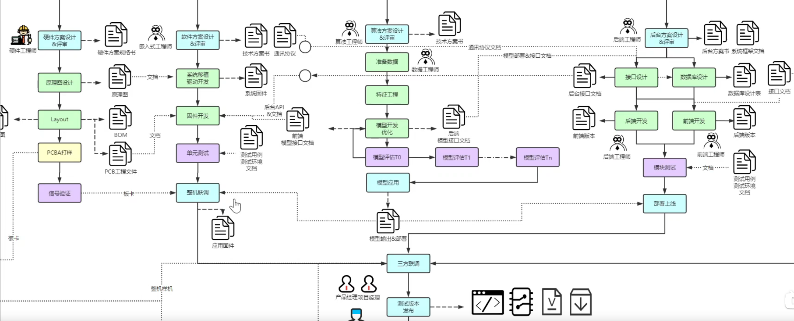

> 

**开发流程**

芯片查询推荐网站 —— 半导小芯

> 
>
> 
>
> 
>
> 


### 嵌入式项目开发流程 - 自动售货机

外观

>

交互 & 执行

> 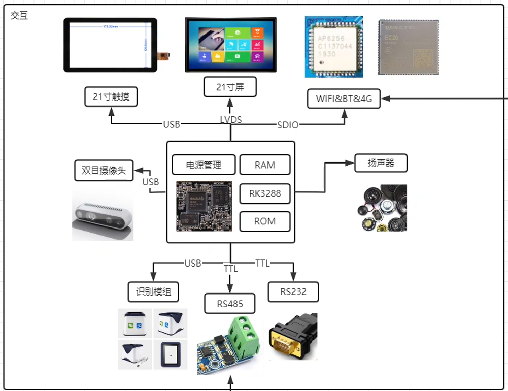
>
> 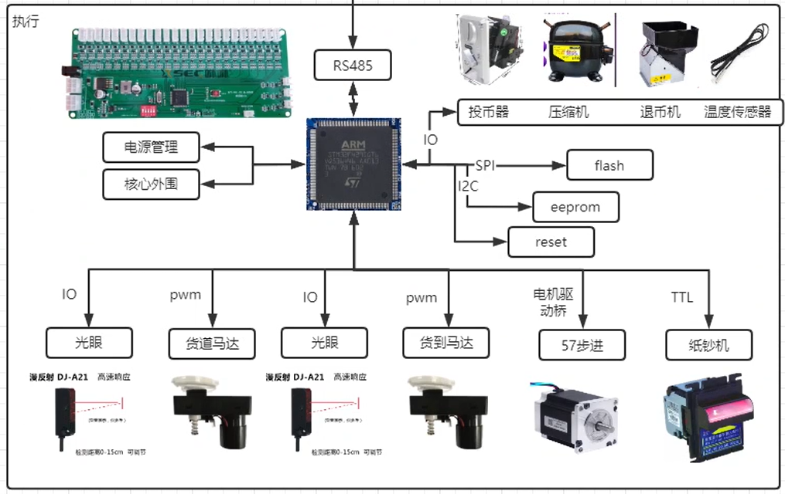

网络 & 服务器

> 
>
> 
>
> 


### 嵌入式项目开发流程 - 智能音箱

>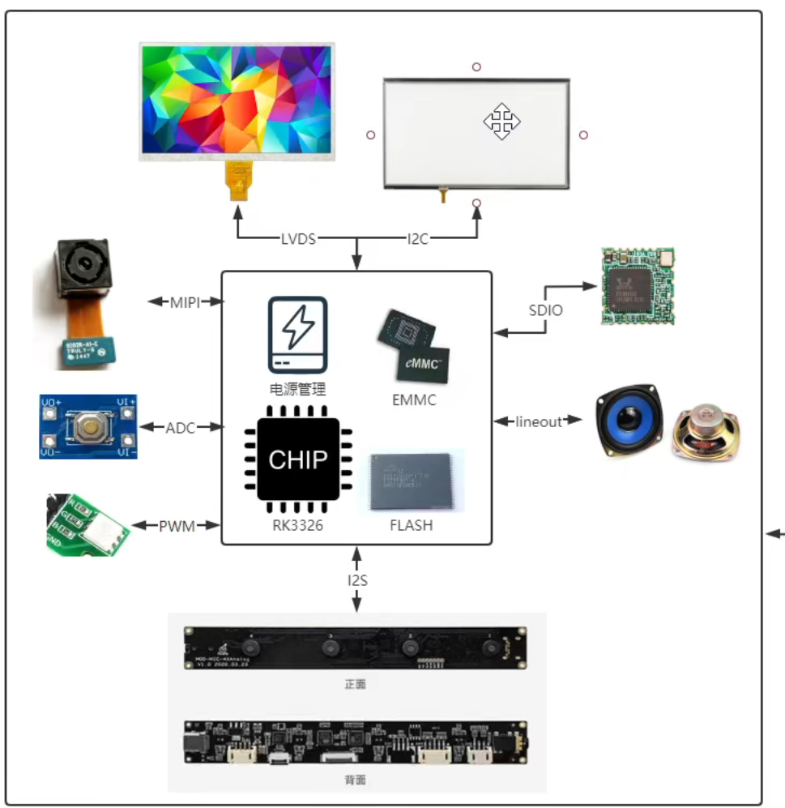
>
>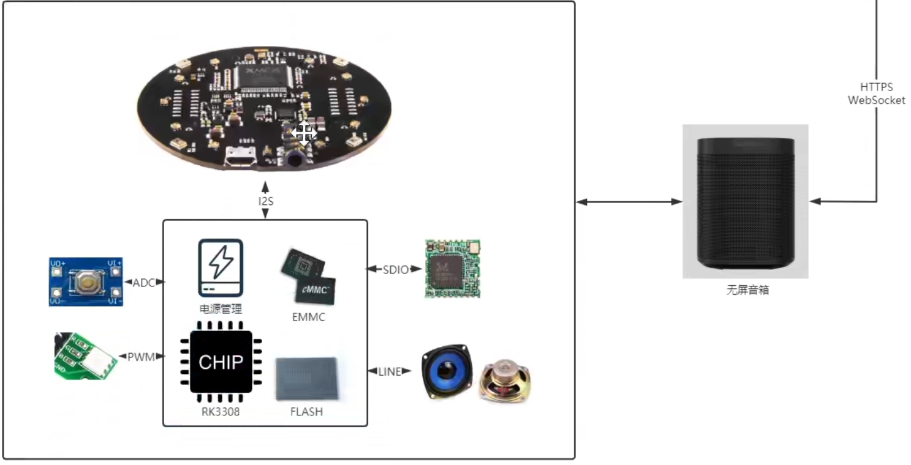
>
>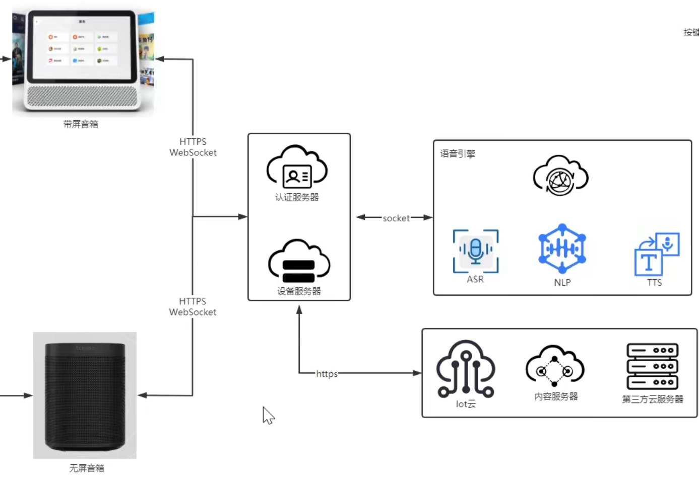
>
>
>
>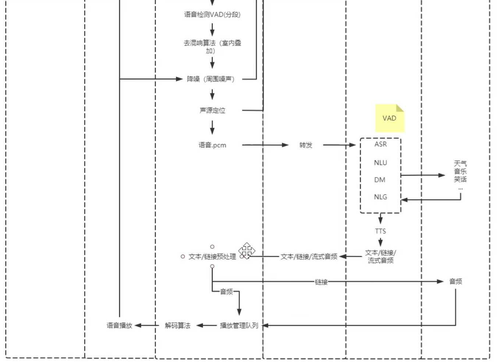

SDK模块框架

> 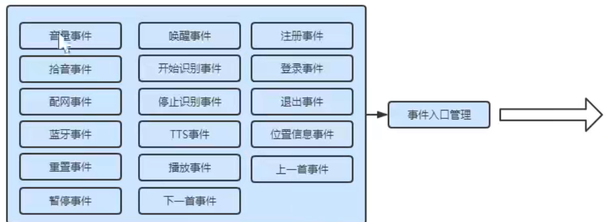
>
> 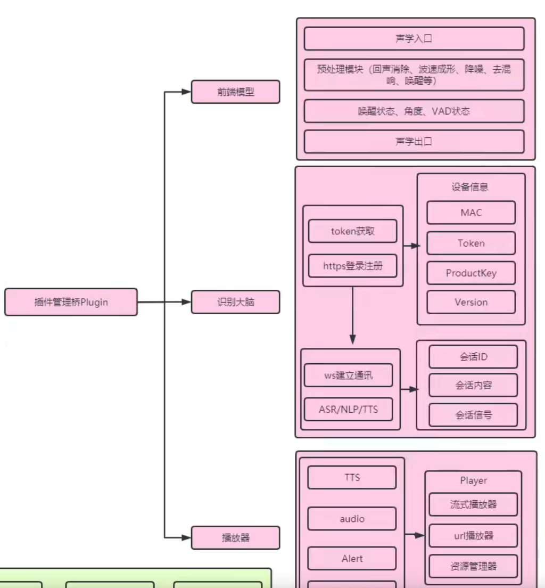
>
> 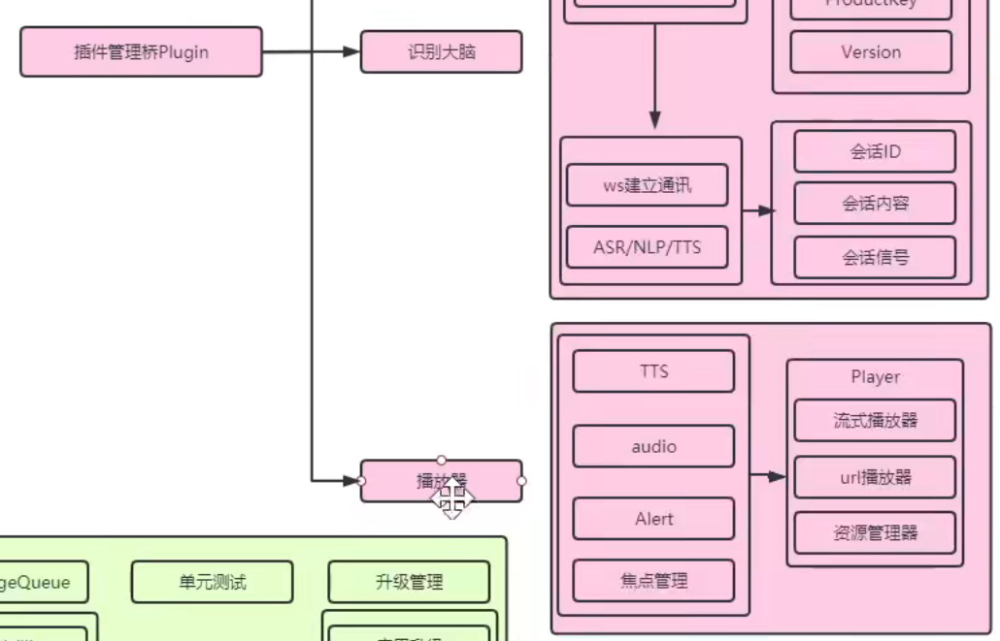
>
> 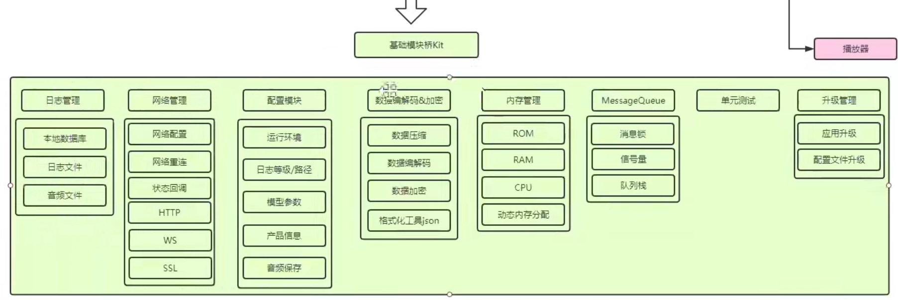
>
> 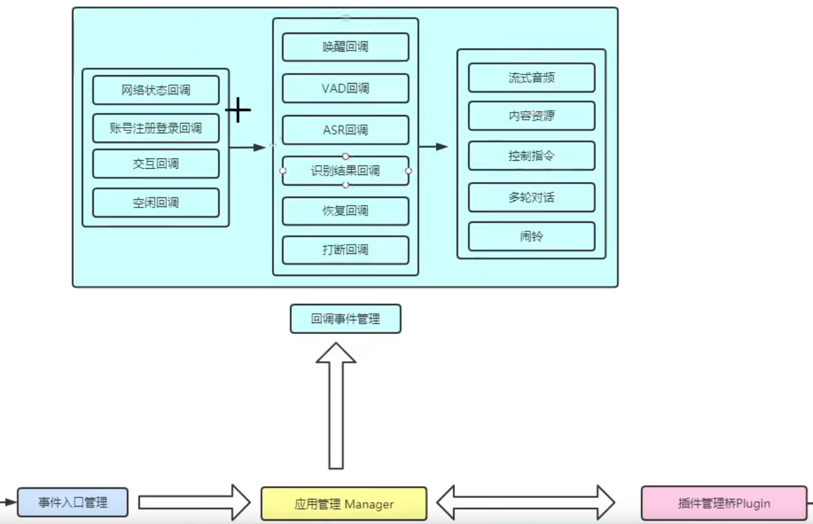


## 测试框架

##### zlog日志框架

```cpp
#include "Log.h"
 
/*************************************************************
** Function name:       EM_LOGLevelGet
** Descriptions:        获取输入的LOG等级的字符串
** Input parameters:    None
** Output parameters:   None
** Returned value:      None
** Remarks:             None
*************************************************************/
char * EM_LOGLevelGet(const int level){
    if (level == LOG_DEBUG){
        return "DEBUG";
    }else if(level == LOG_INFO){
        return "INFO";
    }else if(level == LOG_WARN){
        return "WARING";
    }else if(level == LOG_ERROR){
        return "ERROR";
    }
    return "UNKNOW";
}
 
/*************************************************************
** Function name:       EM_LOG
** Descriptions:        Log管理工具
** Input parameters:    None
** Output parameters:   None
** Returned value:      None
** Remarks:             None
*************************************************************/
void EM_LOG(const int level, const char* funcName,const int line, const char *fmt,...){
    /*  vsnprintf 函数用于向字符串中打印数据 fmt参数是指定输出格式的字符串，arg：可变参数列表  */
    #ifdef OPEN_LOG
    va_list arg;
    va_start(arg,fmt);
    char buf[1+vsnprintf(NULL,0,fmt,arg)];
    vsnprintf(buf,sizeof(buf),fmt,arg);
    va_end(arg);
    if (level >= LOG_LEVEL){
        printf("[%s:%d][%s]: %s\n",funcName,line,EM_LOGLevelGet(level),buf);
    }
    #endif
}
```

```cpp
/***********************************************************************
* @file Log
* Description:
*
**********************************************************************
* File name:      Log.h
* Date:           2021-07-18
* Version:        V1.0
* Author          KongYao
* @history:
* V1.0 创建文件
***********************************************************************/
#ifndef __Log_H__
#define __Log_H__
#include "stdint.h"
#include <stdio.h>
#include <stdarg.h>
 
#define OPEN_LOG 1
#define LOG_LEVEL LOG_DEBUG
 
typedef enum{
    LOG_DEBUG = 0,
    LOG_INFO,
    LOG_WARN,
    LOG_ERROR,
}E_LOGLEVEL;
 
extern void EM_LOG(const int level, const char* funcName,const int line, const char *fmt,...);
 
#define EMLog(level,fmt...)    EM_LOG(level, __FUNCTION__, __LINE__, fmt)
 
#endif //__Log_H__
```

```cpp
#include <stdio.h>
#include <stdarg.h>
#include "Log.h"
 
 
int main(){
    int a = 10, b = 11;
    EMLog(LOG_DEBUG,"app start");
    EMLog(LOG_ERROR,"a = %d b = %d",a,b);
    return 0;
}
```

##### google测试框架

> 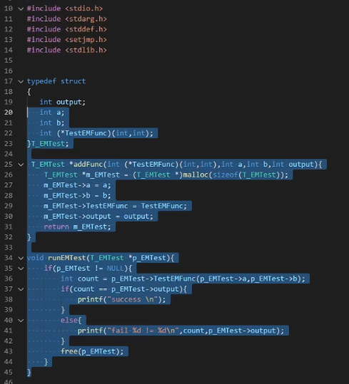

> 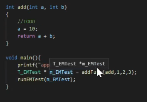


## 嵌入式软件版本命名

最常见的就是V1.0.0这种简单的形式命名,甚至有些同事直接用V1、V2.......或者日期来命名，有点随意了，当然复杂一点就是带有日期、后缀等版本信息。

版本号命名规范就像代码规范一样，不同公司、不同岗位的规范不同。

今天就来简单说下关于版本号命名的常见规范。

这里分享一种通用的版本命名规范，格式：

**主版本号.子版本号.修订版本号.日期_版本阶段**

比如：V1.2.3.20220513_rc

说明：

**第一位（1）：主版本号。**当功能模块有较大的变动，比如增加多个模块或者整体架构发生变化。此版本号由项目决定是否修改。

**第二位（2）：子版本号。**当功能有一定的增加或变化，比如增加了对权限控制、增加自定义视图等功能。此版本号由项目决定是否修改。

**第三位（3）：修订版本号。**一般是 Bug 修复或是一些小的变动，要经常发布修订版，时间间隔不限，修复一个严重的bug即可发布一个修订版。此版本号由项目经理决定是否修改。

**日期版本号（20201228）：**用于记录修改项目的当前日期，每天对项目的修改都需要更改日期版本号。此版本号由开发人员决定是否修改。

**希腊字母版本号(rc)：**此版本号用于标注当前版本的软件处于哪个开发阶段，当软件进入到另一个阶段时需要修改此版本号。此版本号由项目决定是否修改。

软件版本阶段说明：

**Base版:** 此版本表示该软件仅仅是一个假页面链接，通常包括所有的功能和页面布局，但是页面中的功能都没有做完整的实现，只是作为整体网站的一个基础架构。

**Alpha版:** 此版本表示该软件在此阶段主要是以实现软件功能为主，通常只在软件开发者内部交流，一般而言，该版本软件的Bug较多，需要继续修改。

**Beta版:**  该版本相对于α版已有了很大的改进，消除了严重的错误，但还是存在着一些缺陷，需要经过多次测试来进一步消除，此版本主要的修改对象是软件的UI。

RC版: 该版本已经相当成熟了，基本上不存在导致错误的BUG，与即将发行的正式版相差无几。

**Release版:** 该版本意味“最终版本”，在前面版本的一系列测试版之后，终归会有一个正式版本，是最终交付用户使用的一个版本。该版本有时也称为标准版。一般情况下，Release不会以单词形式出现在软件封面上，取而代之的是符号(Ｒ)。

当然还有一些大家经常在某些软件上看到版本所包含的英文词语，如果看不懂就比较尴尬了，但有一个测试版和一个专业版摆在面前，却因为不太了解这些常规命名而选错，下面大致了解下：

- standard：标准版
- full version：完整版，即正式版
- lts：长期维护版本
- ultimate：旗舰版

- alpha：内部版本
- beta：测试版
- demo：演示版
- enhance：增强版
- free：自由版
- lts：长期维护版本
- release：发行版
- rc：即将作为正式版发布
- standard：标准版
- upgrade：升级版


