## 嵌入式基础知识概述 - 小智课程 - HQ

[TOC]

------

#### 注意

- 

------

## STM32学习 - b站嵌入式小智课程

##### 芯片内部介绍

> 

##### STM32F103C8T6芯片引脚图

> 
>
> 

STM32与ST-Link v2，串口转TTL模块接线图

> 

#### 串口打印实验

1.STM32CubeMX配置USART1

Asynchronous同步模式，Synchronous异步模式(需要连同步时钟信号)

> 

特别，sys要设置一下

> 

不知道怎么写程序，怎么函数复用，卒

#### 定时器

> 

#### 电压

> 

#### IO

> 


#### 串口协议

##### TTL

> 

##### 232

> 

##### 485

> 

区别

> 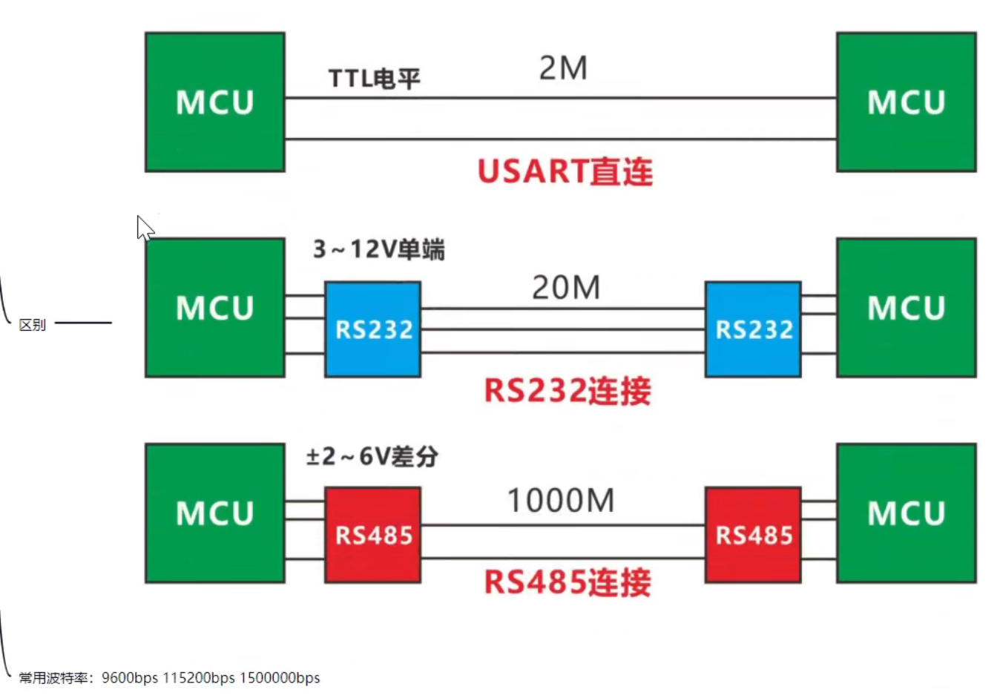


### 主控与模块通讯

开发过程中如何选择什么样的通讯接口 & 通讯接口如何使用

> 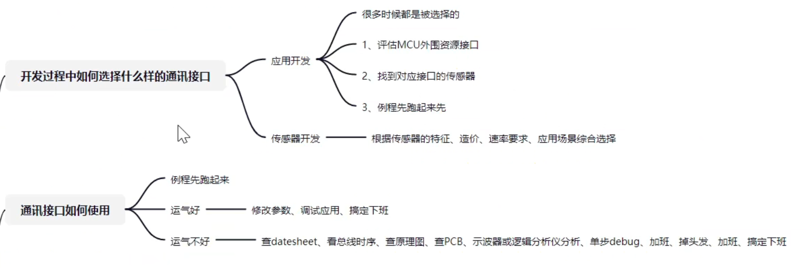

##### IIC

>
>
>

##### SPI

> 

##### IIS

> 

##### SDIO

> 

##### 其他接口

> 


### 看门狗

> 


### 调试Debug

可以将变量a的值，加入watch，查看变量的值得变化

可以设置单步调试等

> 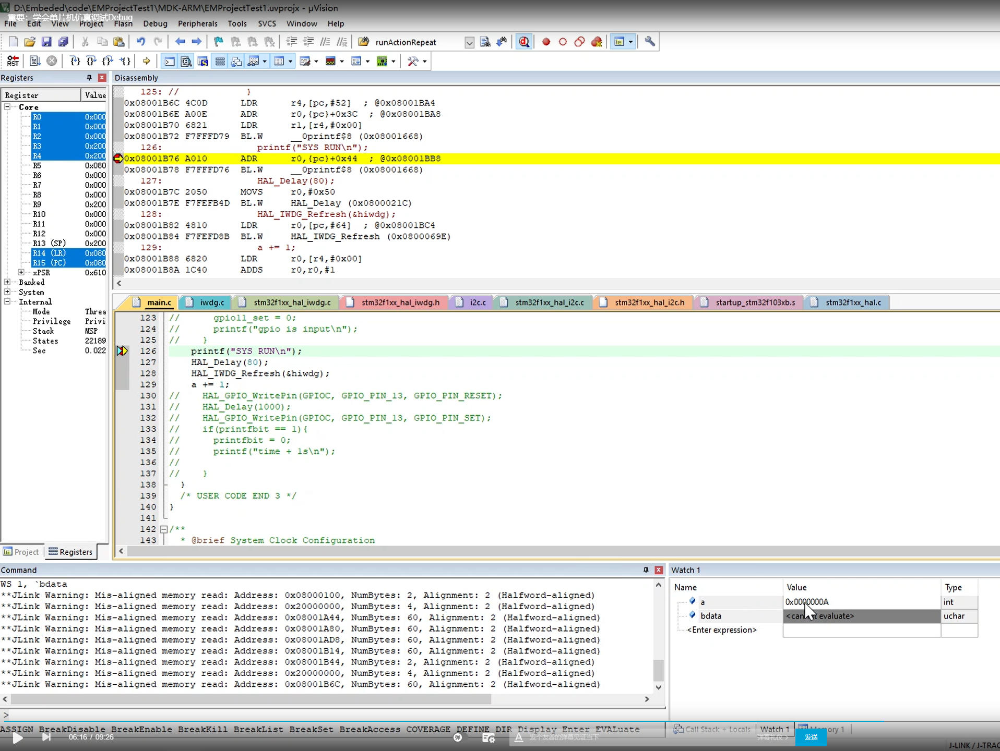


### IAP & OTA远程升级

设备（物联网设备）远程升级、更新功能

单片机flash写入地址设置

> 


调试中心，可查看内存内容

> 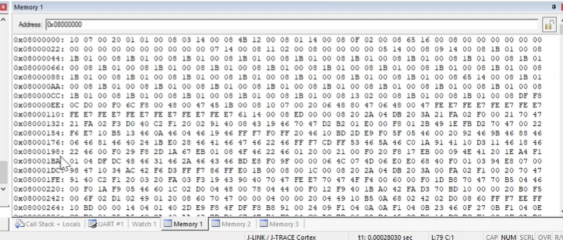

分区设置

BOOT区 -- 引导区，启动

APP区  ---  业务代码

APP升级包存储区  ---   存储接收到的升级代码（加密码，校验码等)

APP备份区 --- 存储备份，保证异常恢复

> 


## 嵌入式RTOS

提高CPU使用率，更好的处理各个进程的运行

> 

架构图

> 

市场情况

> 

任务管理

> 
>
> 

常用函数

1. 任务创建 `xTaskCreat`
2. 任务删除 `vTaskDelete`
3. 任务挂起 `vTaskHandle`
4. 任务恢复 `vTaskResume`

任务延迟

在FreeRTOS里面，提供了相对延迟函数和绝对延迟函数

相对延迟函数，并非严格的延迟，也包括一些中断的耗时

绝对延时函数，时间比较准确，用在如心率测试计时情景

> 


### 内存管理

> 

FreeRTOS提供的五种内存管理方案

> 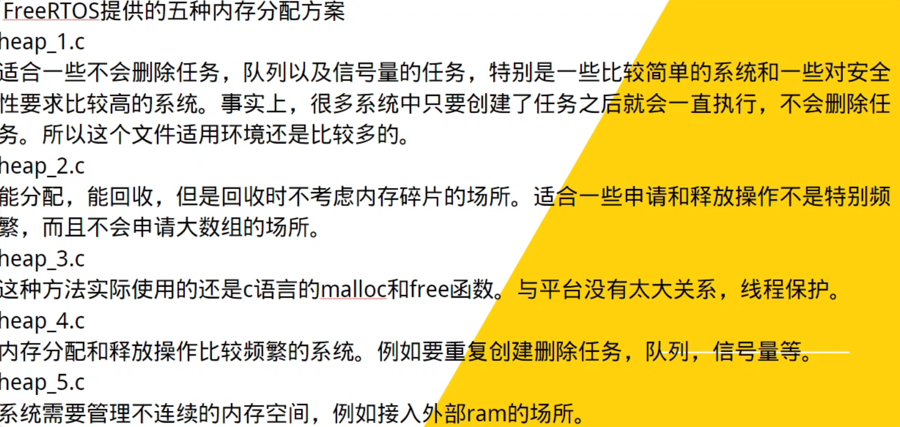

FreeRTOS内核规定的内存管理函数

> 


### 信号量 & 互斥量

> 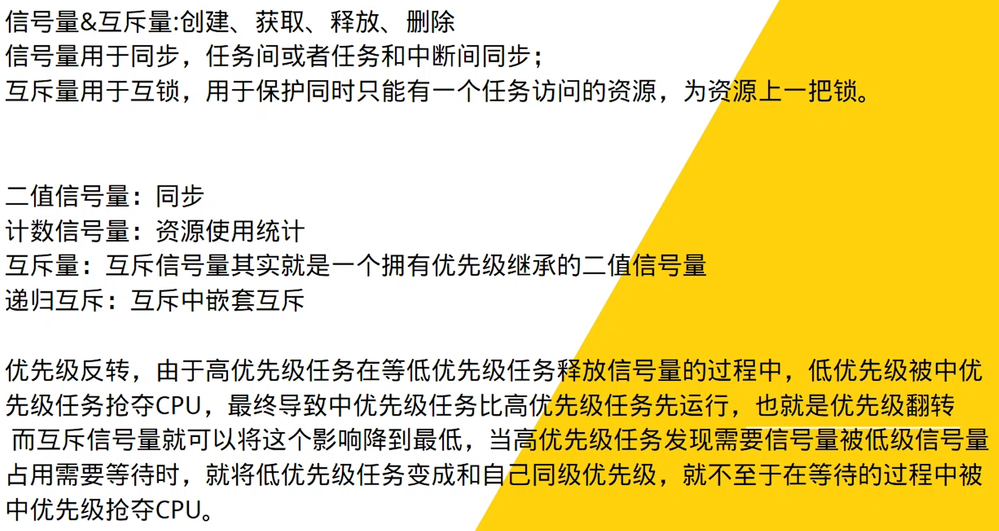


### 消息队列

比如，传结构体：

消息队列，传递的是结构体的指针，

邮箱队列，传递的是整个结构体（开辟一块内存，将结构体复制）。

> 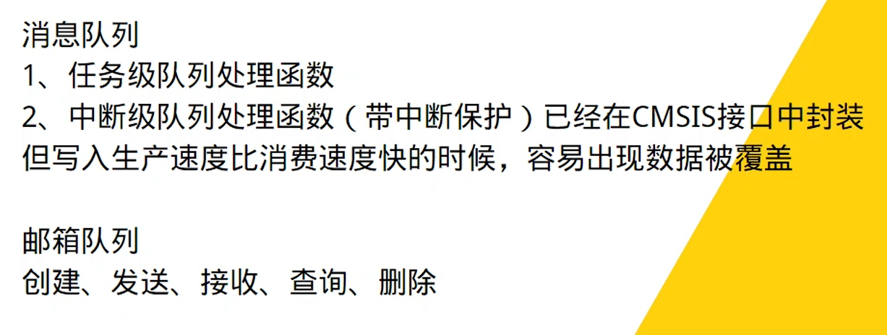


## 嵌入式LINUX

### 快捷键

- 打开新终端 `ctrl + alt + t`

- 终端多开  `ctrl + shift + t`

- 终端切换  `alt + num`

- 查看提示  `ls --help`

- 打印当前路径 `pwd`

- 创建新文件并打开  `gedit test.txt`  &&  `vim test.txt`

- 删除文件夹  `rm test -r`

- 搜索文件  `find -name test.txt`

- 查看文件里的内容  `grep -r "hello"`  &&  `cat test.txt`

- 增加使用权限  `chmod 777 test.txt`

- 进入连接到linux的开发板中   `adb devices `  `adb push`

- 把开发板中的文件下载到linux中  `adb pull `

- tar解压命令是：

  `1、tar –xvf file.tar //解压 tar包`

  `2、tar -xzvf file.tar.gz //解压tar.gz`

  `3、tar -xjvf file.tar.bz2 //解压 tar.bz2`

  `4、tar –xZvf file.tar.Z //解压tar.Z`

  `5、unrar e file.rar //解压rar`

  `6、unzip file.zip //解压zip`

### 虚拟机中安装VS Code 

>## 1.从官网下载压缩包(话说下载下来解压就直接可以运行了咧,都不需要make)
>
>访问Visual Studio Code官网 https://code.visualstudio.com/docs?dv=linux64
>
>我是64位的:
>
>wget https://az764295.vo.msecnd.net/stable/7ba55c5860b152d999dda59393ca3ebeb1b5c85f/code-stable-code_1.7.2-1479766213_amd64.tar.gz
>
>## 2.解压 ,如果文件名不对,可能解压不出来的(扩展名:tar.gz)
>
>tar jxcv code-stable-code_1.7.2-1479766213_amd64.tar.gz
>
>## 3.然后移动到 /usr/local/ 目录
>
>mv VSCode-linux-x64 /usr/local/
>
>## 4.可能还需要给可执行的权限, 然后就已经可以运行了
>
>chmod +x /usr/local/VSCode-linux-x64/code
>
>## 5.复制一个VScode图标文件到 /usr/share/icons/ 目录(后面会有用)
>
>cp /usr/local/VSCode-linux-x64/resources/app/resources/linux/code.png /usr/share/icons/
>
>## 6.创建启动器, 在/usr/share/applications/ 目录, 也可以将它复制到桌面目录
>
>直接在中断 使用 命令: 
>
>vim /usr/share/applications/VSCode.desktop
>
>然后输入以下文本:
>
>[](javascript:void(0);)
>
>```
>[Desktop Entry]
>Name=Visual Studio Code
>Comment=Multi-platform code editor for Linux
>Exec=/usr/local/VSCode-linux-x64/code
>Icon=/usr/share/icons/code.png
>Type=Application
>StartupNotify=true
>Categories=TextEditor;Development;Utility;
>MimeType=text/plain;
>```
>
>[](javascript:void(0);)
>
>保存后退出, 然后可以复制到桌面:
>
>cp /usr/share/applications/VSCode.desktop ~/桌面/
>
>之后 就会发现 桌面和 应用程序菜单都有了 VSCode的快捷方式了
>
>## 8.打开VSCode, 加载插件: cpptools | vscode-icons
>
>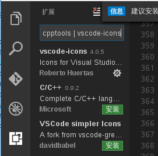

### Linux工程搭建

1. 最朴素  `gcc main.c -o main`

2. 稍微大一点工程，可手写    Makefile

3. 再大一点工程，推荐用   autotools(本质是自动化生成makefile) 

4. 大工程更推荐   cmake(语法简单，高效)

   - 安装  `sudo apt-get install cmake`

   -  查看版本  `cmake -version`

   - > 

   - > 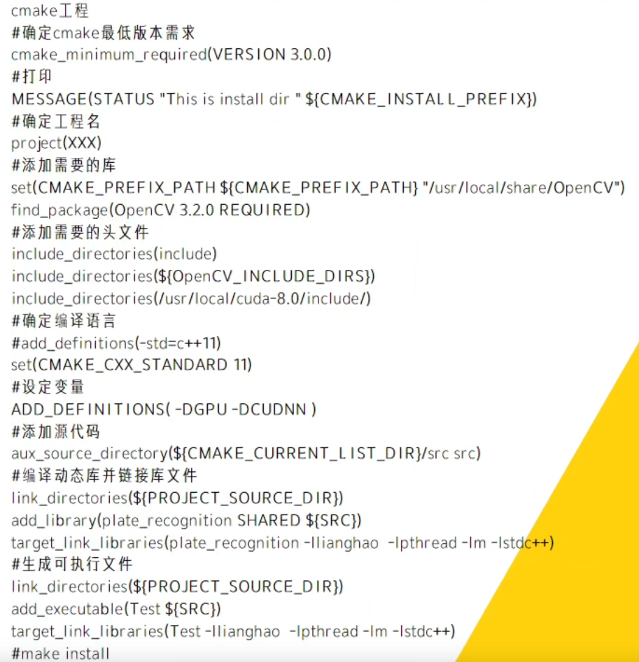


### Linux多线程的使用

不同系统的多线程比较

> 

线程通讯 & 同步

> 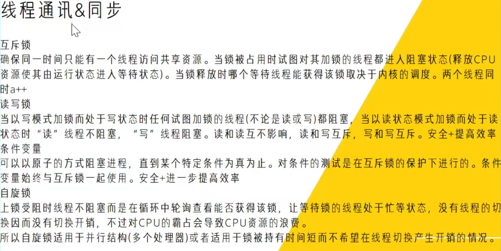

自旋锁  与  互斥&读写&条件变量  对比 

> 

信号量

> 


### Linux多进程的使用

多进程

> 

进程通信方式

socket通常用于多机通讯

> 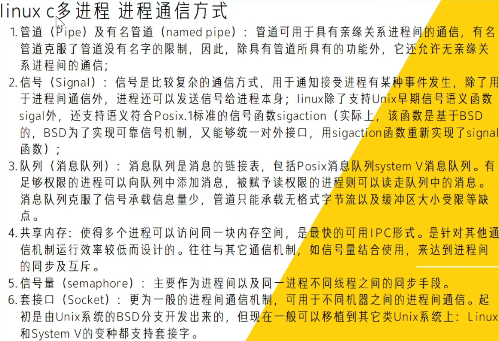

消息队列和管道对比

> 
>
> 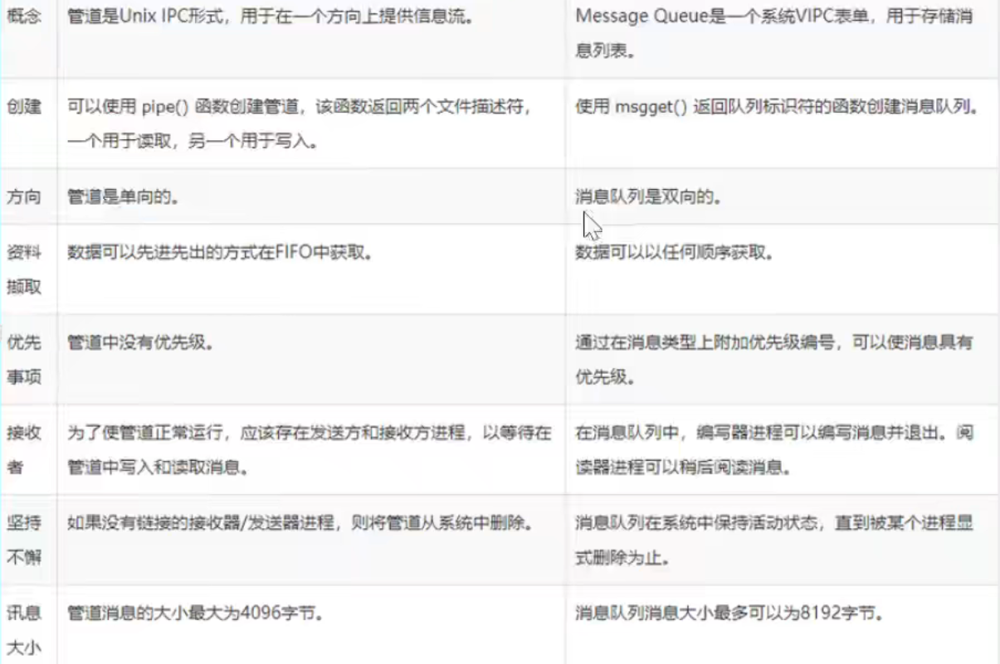


### Linux文件编程

> 

案例代码

> 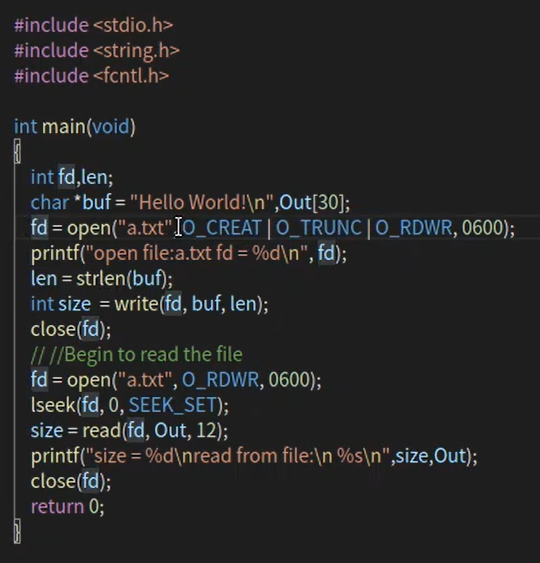


### Linux网络编程

> 

网络7层模型

> 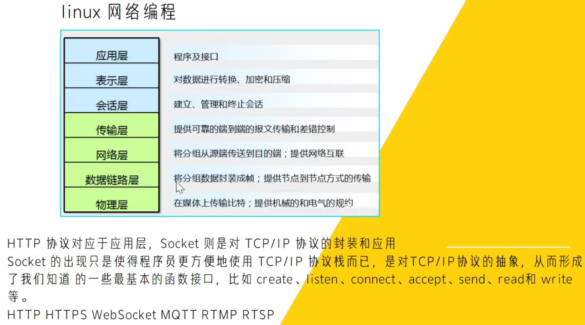

服务器-客户端通讯过程

> 


